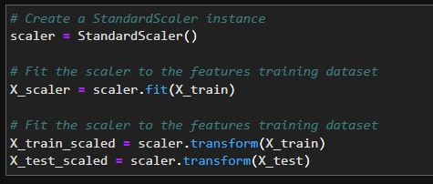
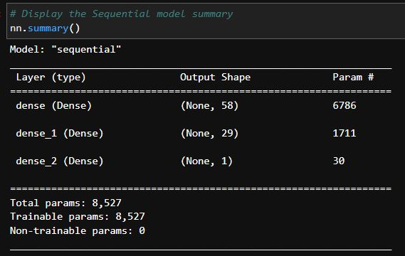
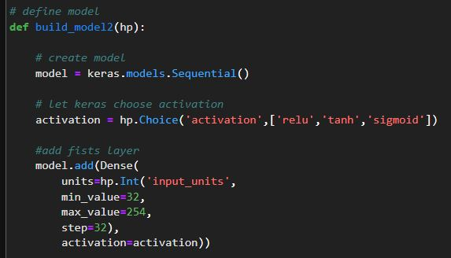
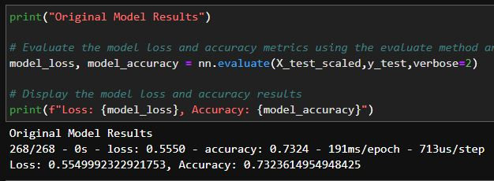

Module 13 Challenge

In this project, predictive models are built using deep neural networks to determine whether applicantsa in search for funding will be successful.
2 simulations are run with different training data.  A 3rd is run using Keras Tuner.

---


## Technologies


This project uses Python 3.9.7 and the following libraries - 


| Library | Version | Documentation
|----|----|---|
| pandas |1.4.2| [pandas docs](https://pandas.pydata.org/docs)
| tensorflow |2.9.1| [tensorflow docs](https://github.com/tensorflow/docs)
| sklearn | 1.1.2 | [sklearn docs](https://scikit-learn.org/stable/)
| keras tuner | 1.0.0 | [keras tuner docs](https://keras.io/keras_tuner/)

---


## Installation Guide


```
pip install -U scikit-learn

pip install keras-tuner --upgrade
```


---


## Usage


3 simulations were ran in determining accuracy


|<p align="center">Scaling Data</p>|
|---|
|<p align="center"></p>|
|<p align="center">**Model Summary**</p>|
|<p align="center">|
|<p align="center">**Keras Tuner Model**</p>|
|<p align="center">|
|<p align="center">**Evaluations**</p>|
|<p align="center">|
---


## Contributors

Dan McQueen

dandmcqueen@gmail.com

[Linkedin](https://www.linkedin.com/in/dan-mcqueen-4a5980238/)

---


## License

[GNU v3.0](LICENSE)
